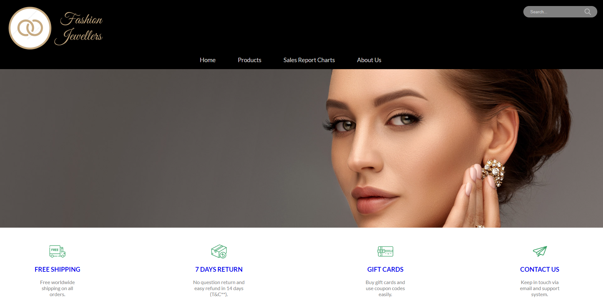
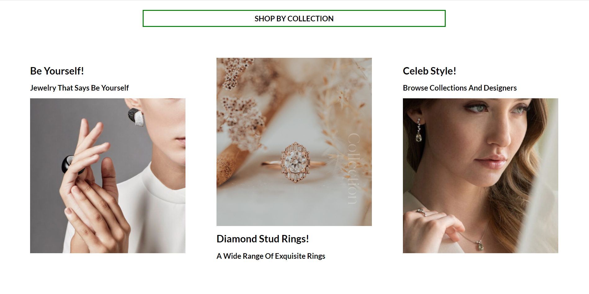
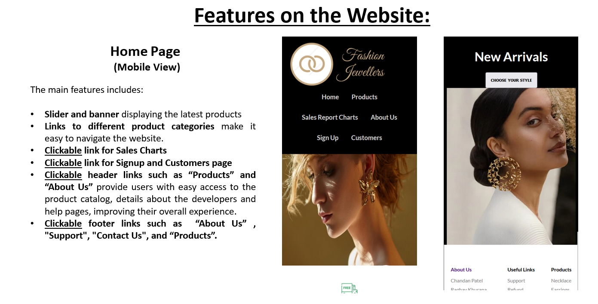
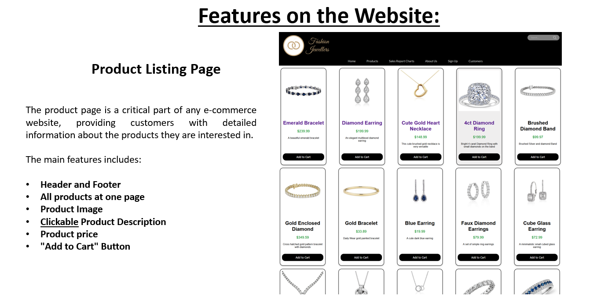
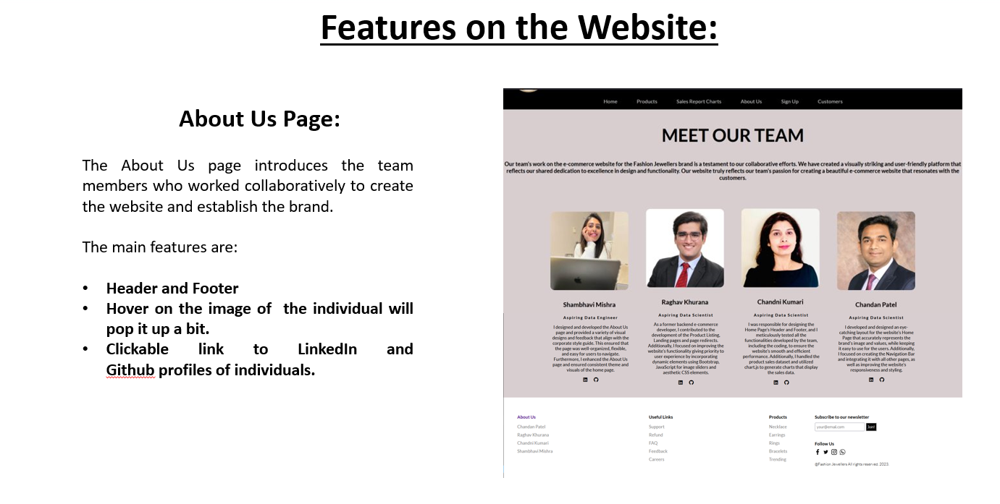
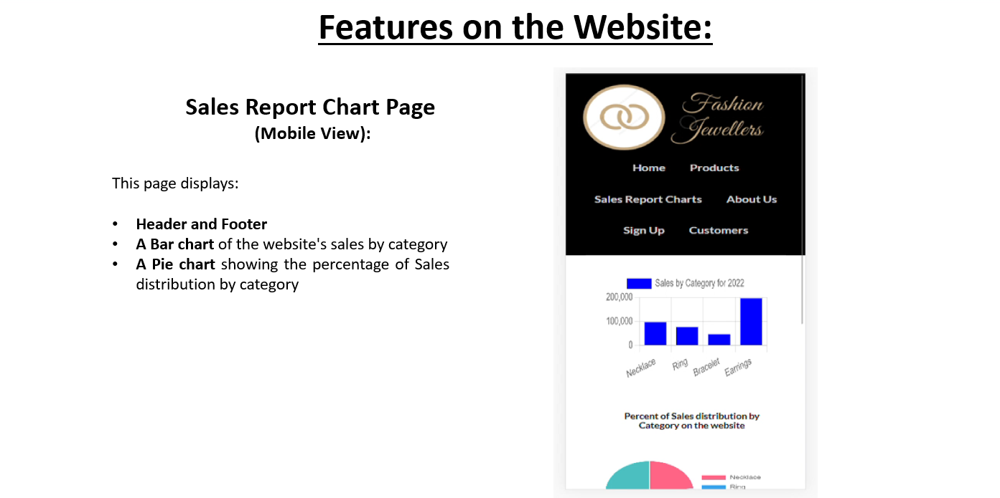
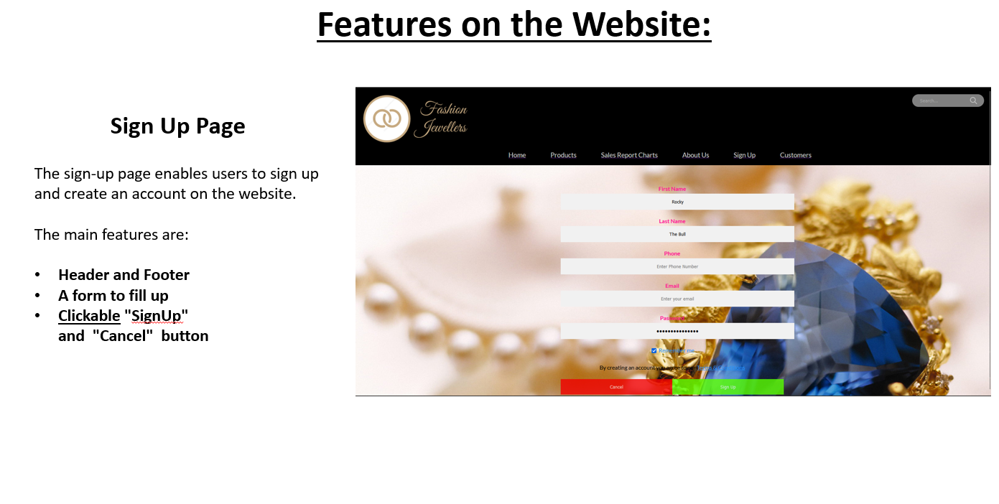

# Introduction

- Fashion Jewellers is an exquisite online emporium of fine Jewellery,
  where timeless beauty meets impeccable craftsmanship. The website
  presents a visually striking and user-friendly experience that
  reflects our dedication to excellence in design and functionality. We
  aim to provide a well-structured, responsive, and easy-to-navigate
  webpage for customers developed using HTML, CSS, and JavaScript.

- The Flask app developed for the Fashion Jewellers website is a web
  application built using Python's Flask framework. It allows users to
  browse and purchase various types of jewelry products online.

- IDE for building the website and the Flask app is Visual Studio Code.

# Features

**Home Page:** The home page of the website features a slideshow and
banner showcasing the latest products, a search bar, and links to
different product categories. It also has some useful clickable links
such as Contact Us, Support, etc.

**Product Page:** This page displays the products available for
purchase, along with their description, image, and price.

**Sales Report Chart Page:** This page displays a chart of the website's
sales enabling the team to analyze sales trends and make informed
business decisions.

**About Us Page:** The about us page introduces the team members who
worked collaboratively to create the website.

**SignUp Page:** The SignUp page enables users to create an account on
the website.

**Customers Page**: This page enables users to see the list of signed up
customers.

Home Page: The home page of the website is the main entry point for
users, providing a clear and intuitive layout and creating a visually
appealing experience that attracts visitors' attention.

The main features includes:

- **Slider and banner** displaying the latest products

- **Search bar** enables users to quickly find the products they are
  interested in

- **Links to different product categories** make it easy to navigate the
  website.

<!-- -->

- **<u>Clickable</u> link for Sales Charts**

- **<u>Clickable</u> link for Signup and Customers page**

<!-- -->

- **Clickable header links such as “Products” and “About Us” **provide
  users with easy access to the product catalog, details about the
  developers and help pages, improving their overall experience.

- **Clickable footer links such as  “About Us” , "Support", "Contact
  Us", and “Products”.**

